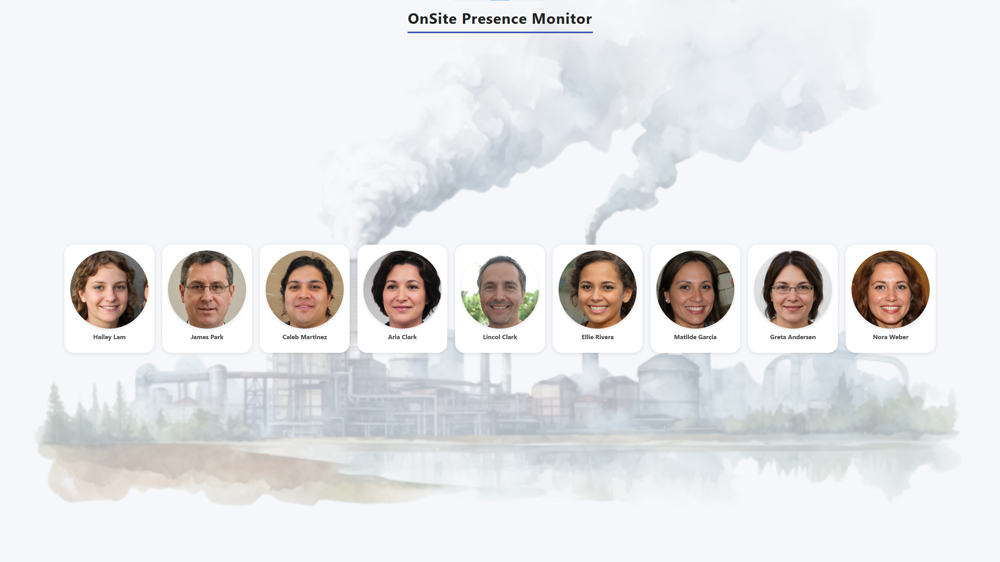

# OnSite Presence Monitor

> OnSite Presence Monitor is a web-based dashboard for displaying who is currently clocked in at a worksite — powered by ERP data.

Built with [Dash](https://dash.plotly.com/) and designed to be extendable with real ERP clients (e.g. Monitor G5 API). Comes with a mock client for demo and development.

---

## 🤔 Why Use This?

Evacuation safety, shift tracking, or just visibility — this tool provides a real-time view of who's on site, with photo identification.

Built for kiosks, control rooms, and managers who need clarity without digging into the ERP or displaying sensitive information.

---

## 🚀 Features

- Live list of clocked-in users
- Photo-based display with styled UI
- Modular ERP client system (mock included)
- Easily swappable for real-time integrations

---

## 📦 Installation

```bash
git clone https://github.com/yourusername/OnSite-Presence-Monitor.git
cd OnSite-Presence-Monitor
python -m venv .venv
source .venv/bin/activate  # On Windows use .venv\Scripts\activate
pip install -r requirements.txt
```

---

## 🧪 Run the App

```bash
python run_production.py
```

Visit [http://127.0.0.1:8050](http://127.0.0.1:8050) in your browser.

---

## 🧰 Demo Mode (Mock ERP Client)

The project includes a built-in mock ERP client for testing and demonstration purposes.

This client (`MockERPClient`) simulates real ERP behavior by:
- Loading employee clock-in/out schedules from a CSV file
- Filtering active workers based on the current system time
- Returning user data with names, IDs, and work locations
- Supporting presence logic for multiple shifts

This allows you to:
- Run the app locally with zero external dependencies
- Develop and test features without live ERP access
- Easily simulate different shift patterns by editing `data/sample_data.csv`

No API keys, servers, or database connections are required in demo mode.

---

## 📁 Project Structure

```
.
├── app.py
├── api_client/
│   ├── __init__.py
│   ├── base_client.py
│   ├── mock_client.py
│   └── monitor_g5_client.py
├── assets/
│   ├── employee_images/
│   └── style.css
├── data/
│   └── sample_data.csv
├── docs/
│   ├── CHANGELOG.md
│   └── TODO.md
├── logs/
│   └── presence.log
├── tests/
│   ├── test_app.py
│   ├── test_mock_client.py
│   └── test_monitor_g5_client.py
├── config.yaml
├── LICENSE
├── logger.py
└── README.md
```

---

## 🧩 Add Your Own ERP Client

Just inherit from `BaseERPClient` and implement `get_workers()`, returning a list of `UsersList` entries.

```python
class MyERPClient(BaseERPClient):
    def get_workers(self):
        # connect to your real ERP here
        return [...]
```

---

## 📷 Screenshots

### ✅ Day Shift (Most are clocked in)


---

### 🌆 Evening Shift (Fewer workers clocked in)


---

### 🚨 Empty State (No One Clocked In)


## 📝 License

This project is licensed under the [MIT License](LICENSE).  
© 2025 Tom Erik Harnes